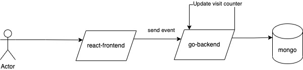
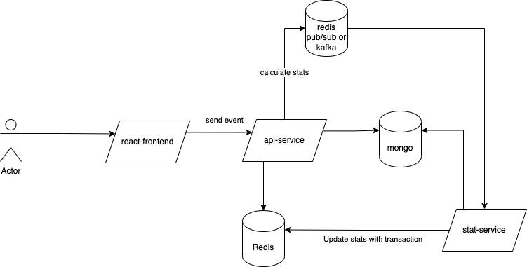

## Architecture
Current version: 
I just make this app as simple as possible although I know that there are some potential bottlenecks.
1. Backend: Go
2. Frontend: React
3. Database: Mongo as the primary storage

- The reason I choose Mongo is that events will be sent a lot. Therefore, We need a database have a good write throughput. (Relational databases may be slower with high write workload)
- Everytime, an event is saved to the database, I update the visit count collection asynchronously using goroutine and the operation I use in this function is $inc (atomic operation) so concurrency problem will not happen.

Where is the bottleneck ? At this time, I collect top 100 latest visitor by using sort and offset 0 100.
Sort will take O(nlogn) time => Numbers of events grows time by time, the sort is not an optimal solution.
- Solution: I need a stack having a fixed size in order to store only 100 items. items added before will be removed if the stack has more items than the limit. Sorting 100 items is faster than doing with the whole table.
Redis is the first thing I think about because of its performance and data structure its support. However, We need to update redis in a transaction to guarantee the consistency.

What if when the main process is dead ? Visit count could not be calculated correctly because goroutine could be dead with its parent. To solve this issue we need to a message broker in order to buffer the next step and retry when an error occurs.

Next version:


## Local Run
### Backend (go 1.16.3+)
1. cd backend
2. go run <b>main.go
### Frontend (React, Node: v16.3+)
1. cd frontend
2. npm install
2. npm start

Note: Currently, proxy server is set up in <b>package.json
## Docker Run
1. Build docker image by using this command ```docker build -t <your-tag> .```
2. Run docker container with this command ```docker run -d -e PORT=<your-port> -p <your-port>:<your-port> --name <your-tag> location-ap```